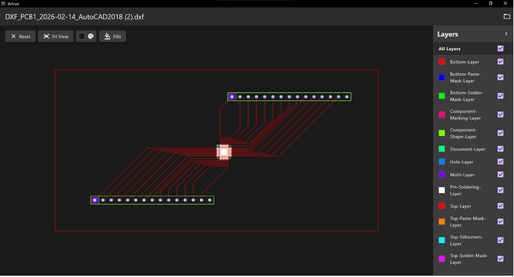

# DXFVue (Simple DXF viewer )

This is a simple DXF viewer like the photos no spam of options etc.
In reponse to resent DXF viewer app that spams and over kills the task.

This app is made with flutter so from a single code base it can,
build for windows linux ios and android.
  
Checklist:  
GUI setup - done  
Open DXF and display DXF file - done  
add Layers Pane with on off function - done  
add fit to screen btn - Done  
add Reset btn - Done  
add color BG change btn - Done  
add layers color select option - Done  
sample test design dxf and debug - Done  
sample test eda dxf and debug - done  
add assign layer colors on load - done  
add all layers checkbox - done  
android setup - done  
drag drop only from mobile app - done  
mobile app only landscape mode - done  
sample dxf files - done  
--------------------------------------------------------- V1.1  
ReRender on new color selection  
Fills feature under development  
Reverse or make negative - in future  
comment debug log - done  
--------------------------------------------------------- Next version  
  
Testing check list:  
change bg color  
zoom n pan  
fit to view btn  
all layer on off  
layer on off  
reset btn  
  

  

<!--  -->

Regards
Balachandran